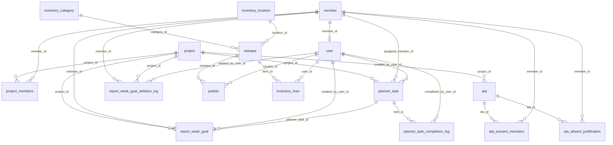

# Modelagem do Banco de Dados

Fonte de verdade: `src/database.js` (`ensureSchema()` + migrações idempotentes).
Banco atual: **PostgreSQL (Neon)**.
Última revisão: **25/04/2026**.

## 1) Domínios

- Identidade e acesso: `member`, `user`
- Projetos e governança: `project`, `project_members`
- Atas: `ata`, `ata_present_members`, `ata_absent_justification`
- Relatórios: `report_entry` (legado), `report_week_goal`, `report_week_goal_deletion_log`
- Planner: `planner_task`, `planner_task_completion_log`, `task_audit_log`
- Almoxarifado: `estoque`, `pedido`, `inventory_category`, `inventory_location`, `inventory_loan`

## 2) Relacionamentos principais

## 3) Tabelas críticas

### `member`
- `id` PK
- `name` UNIQUE NOT NULL
- `photo` TEXT
- `is_active` INTEGER (0/1)

### `user`
- `id` PK
- `username` UNIQUE NOT NULL
- `password_hash` NOT NULL
- `name` TEXT
- `role` (`admin` | `common`)
- `member_id` FK opcional

### `project`
- `id` PK
- `name` UNIQUE NOT NULL
- `logo` TEXT
- `primary_color` TEXT

### `project_members`
- `project_id` FK -> `project.id`
- `member_id` FK -> `member.id`
- `is_coordinator` INTEGER (0/1)
- PK composta (`project_id`, `member_id`)

### `report_week_goal`
- `id` PK
- `member_id`, `project_id`, `created_by_user_id`
- `week_start` (chave quinzenal)
- `due_at`, `activity`, `description`
- `planner_task_id` (vínculo opcional com planner)
- `goal_source` (`manual` | `planner`)
- `task_state` (`active` | `missed`)
- `is_completed`, `completed_at`
- `created_at`, `updated_at`

### `report_week_goal_deletion_log`
- trilha de exclusão de metas concluídas:
- `goal_id`, `member_id`, `project_id`, `deleted_by_user_id`
- `week_start`, `activity`, `description`, `completed_at`, `deleted_at`

### `planner_task`
- `id` PK
- `project_id`, `assigned_member_id`, `created_by_user_id`
- `title`, `description`
- `status` (`todo` | `in_progress` | `done`)
- `priority` (`low` | `medium` | `high` | `urgent`)
- `label`
- `due_at`
- `is_completed`, `completed_at`
- `workflow_state` (`active` | `missed`)
- `missed_at`
- `last_extended_at`, `last_extended_by_user_id`
- recorrência:
  - `recurrence_interval_days`
  - `recurrence_unit`
  - `recurrence_every`
  - `recurrence_member_queue`
  - `recurrence_next_index`
- `created_at`, `updated_at`

### `planner_task_completion_log`
- histórico de conclusão com snapshot:
- `task_id`, `project_id`, `assigned_member_id`, `completed_by_user_id`
- `title`, `description`, `status`, `priority`, `label`, `due_at`, `completed_at`

### `task_audit_log`
- auditoria técnica de ciclo de vida:
- `task_id`, `report_goal_id`, `member_id`, `project_id`
- `event_type`
- `actor_user_id`
- `payload_json`
- `created_at`

## 4) Índices relevantes

- `project_members(project_id, is_coordinator)`
- Relatórios: índices por `member_id`, `project_id`, `week_start`, `is_completed`, `due_at`, `task_state`
- Planner: índices por `project_id`, `assigned_member_id`, `due_at`, `is_completed`, `status`, `workflow_state`
- Auditoria: `task_audit_log` por `task_id`, `report_goal_id`, `event_type`, `created_at`

## 5) Regras de modelagem aplicadas

- Coordenador é vínculo contextual em `project_members.is_coordinator`.
- Relatório e Planner se mantêm consistentes via `planner_task_id`.
- Estado `missed` representa tarefa não concluída dentro da janela operacional.
- Ações críticas registram histórico em `task_audit_log`.
- Exclusão de meta concluída registra trilha em `report_week_goal_deletion_log`.

## 6) Observações operacionais

- Migrações em `ensureSchema()` devem ser idempotentes.
- Qualquer coluna nova precisa:
  1. entrar no `CREATE TABLE IF NOT EXISTS`,
  2. ser reforçada por `ensureColumn`,
  3. ser documentada neste arquivo.
