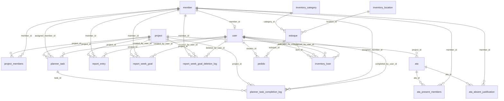

# Modelagem do Banco de Dados

Fonte de verdade: `src/database.js` (`ensureSchema()`).

Banco em uso: PostgreSQL (Neon).

## 1) Domínios principais

- Pessoas e acesso: `member`, `user`
- Projetos e atas: `project`, `project_members`, `ata`, `ata_present_members`, `ata_absent_justification`
- Relatórios: `report_entry`, `report_week_goal`, `report_week_goal_deletion_log`
- Planner: `planner_task`, `planner_task_completion_log`
- Almoxarifado: `estoque`, `pedido`, `inventory_category`, `inventory_location`, `inventory_loan`

## 2) Diagrama ER (resumido)

## 3) Tabelas e campos (resumo técnico)

### `member`
- `id` PK
- `name` UNIQUE NOT NULL
- `photo` TEXT
- `is_active` INTEGER (0/1)

### `user`
- `id` PK
- `username` UNIQUE NOT NULL
- `password_hash` NOT NULL
- `name` TEXT
- `role` TEXT (`admin` | `common`)
- `member_id` FK -> `member.id` (opcional)

### `project`
- `id` PK
- `name` UNIQUE NOT NULL
- `logo` TEXT
- `primary_color` TEXT (hex)

### `project_members`
- `project_id` FK -> `project.id`
- `member_id` FK -> `member.id`
- `is_coordinator` INTEGER (0/1)
- PK composta (`project_id`, `member_id`)

### `ata`
- `id` PK
- `meeting_datetime` TEXT
- `location_type`, `location_details`, `notes`
- `created_at`
- `project_id` FK -> `project.id`

### `ata_present_members`
- `ata_id` FK -> `ata.id`
- `member_id` FK -> `member.id`
- PK composta (`ata_id`, `member_id`)

### `ata_absent_justification`
- `ata_id` FK -> `ata.id`
- `member_id` FK -> `member.id`
- `justification`
- PK composta (`ata_id`, `member_id`)

### `report_entry` (legado)
- `id` PK
- `project_id`, `member_id`, `created_by_user_id`
- `week_start`
- `status` (`completed` | `in_progress` | `blocked`)
- `content`, `created_at`, `updated_at`

### `report_week_goal`
- `id` PK
- `member_id`, `project_id`, `created_by_user_id`
- `week_start`
- `activity`, `description`
- `is_completed`, `completed_at`
- `created_at`, `updated_at`

### `report_week_goal_deletion_log`
- `id` PK
- `goal_id` (id da meta original)
- `member_id`, `project_id`, `deleted_by_user_id`
- `week_start`, `activity`, `description`, `completed_at`
- `deleted_at`

### `planner_task`
- `id` PK
- `project_id`, `assigned_member_id`, `created_by_user_id`
- `title`, `description`
- `status` (`todo` | `in_progress` | `done`)
- `priority` (`low` | `medium` | `high` | `urgent`)
- `label` TEXT
- `due_at`
- `is_completed`, `completed_at`
- recorrência: `recurrence_interval_days`, `recurrence_unit`, `recurrence_every`, `recurrence_member_queue`, `recurrence_next_index`
- `created_at`, `updated_at`

### `planner_task_completion_log`
- `id` PK
- `task_id` FK -> `planner_task.id`
- `project_id`, `assigned_member_id`, `completed_by_user_id`
- `title`, `description`
- `status`, `priority`, `label`
- `due_at`, `completed_at`

### `inventory_category`
- `id` PK
- `name` UNIQUE NOT NULL

### `inventory_location`
- `id` PK
- `name` UNIQUE NOT NULL

### `estoque`
- `id` PK
- `name`
- `item_type` (`stock` | `patrimony`)
- `category` (legado), `category_id` (normalizado)
- `location` (legado), `location_id` (normalizado)
- `amount`, `description`

### `pedido`
- `id` PK
- `qtd_retirada`
- `usuario_id` FK -> `user.id`
- `estoque_id` FK -> `estoque.id`
- `data_pedido`

### `inventory_loan`
- `id` PK
- `item_id`, `user_id`
- `quantity`
- `borrowed_at`, `original_due_at`, `due_at`
- `returned_at`, `extended_at`
- `extended_by_user_id`, `returned_by_user_id`

## 4) Índices importantes

- `project_members(project_id, is_coordinator)`
- Relatórios por membro/projeto/semana/conclusão
- Planner por projeto/membro/data/status/prioridade
- Logs do planner por tarefa/projeto/membro/data
- Almox por nome/tipo/categoria/local e empréstimos por prazo/retorno

## 5) Regras refletidas no schema

- Coordenação de projeto é contextual (`project_members.is_coordinator`).
- Metas concluídas podem ser removidas com trilha em `report_week_goal_deletion_log`.
- Planner suporta recorrência com fila de membros.
- Almox mantém compatibilidade com colunas legadas e também catálogo normalizado.

## 6) Observações operacionais

- A função `deleteUser` limpa vínculos e histórico dependente antes de remover usuário.
- Toda evolução de schema deve ser idempotente em `ensureSchema()` e documentada aqui.
