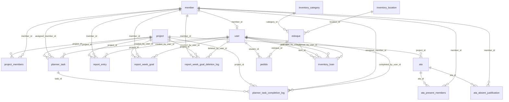

# Modelagem do Banco de Dados

Fonte de verdade: `src/database.js` (`ensureSchema()` + migrações idempotentes com `ensureColumn`).
Banco atual: **PostgreSQL (Neon)**.
Última revisão: **22/04/2026**.

## 1) Domínios

- Identidade e acesso: `member`, `user`
- Projetos e governança: `project`, `project_members`
- Atas: `ata`, `ata_present_members`, `ata_absent_justification`
- Relatórios: `report_entry` (legado), `report_week_goal`, `report_week_goal_deletion_log`
- Planner: `planner_task`, `planner_task_completion_log`, `task_audit_log`
- Almoxarifado: `estoque`, `pedido`, `inventory_category`, `inventory_location`, `inventory_loan`

## 2) Diagrama ER (resumo)

## 3) Tabelas essenciais

### `member`
- `id` PK
- `name` UNIQUE NOT NULL
- `photo` TEXT
- `is_active` INTEGER (0/1)

### `user`
- `id` PK
- `username` UNIQUE NOT NULL
- `password_hash` NOT NULL
- `name` TEXT
- `role` TEXT (`admin` | `common`)
- `member_id` FK opcional -> `member.id`

### `project`
- `id` PK
- `name` UNIQUE NOT NULL
- `logo` TEXT
- `primary_color` TEXT

### `project_members`
- `project_id` FK -> `project.id`
- `member_id` FK -> `member.id`
- `is_coordinator` INTEGER (0/1)
- PK composta (`project_id`, `member_id`)

### `report_week_goal` (fonte de verdade do Relatório)
- `id` PK
- `member_id`, `project_id`, `created_by_user_id`
- `week_start` (quinzena)
- `due_at` (prazo real da tarefa)
- `activity`, `description`
- `planner_task_id` (vínculo 1:1 opcional com planner)
- `goal_source` (`manual` | `planner`)
- `task_state` (`active` | `missed`)
- `is_completed`, `completed_at`
- `created_at`, `updated_at`

Observação: índice único parcial em `planner_task_id` evita duplicar a projeção da mesma tarefa.

### `report_week_goal_deletion_log`
- trilha de exclusão de metas concluídas:
- `goal_id`, `member_id`, `project_id`, `deleted_by_user_id`, `week_start`, `activity`, `description`, `completed_at`, `deleted_at`

### `planner_task` (planejamento operacional)
- `id` PK
- `project_id`, `assigned_member_id`, `created_by_user_id`
- `title`, `description`
- `status` (`todo` | `in_progress` | `done`)
- `priority` (`low` | `medium` | `high` | `urgent`)
- `label`
- `due_at`
- `is_completed`, `completed_at`
- `workflow_state` (`active` | `missed`)
- `missed_at`
- `last_extended_at`, `last_extended_by_user_id`
- recorrência: `recurrence_interval_days`, `recurrence_unit`, `recurrence_every`, `recurrence_member_queue`, `recurrence_next_index`
- `created_at`, `updated_at`

### `planner_task_completion_log`
- histórico de conclusões:
- `task_id`, `project_id`, `assigned_member_id`, `completed_by_user_id`
- snapshot: `title`, `description`, `status`, `priority`, `label`, `due_at`
- `completed_at`

### `task_audit_log`
- auditoria de ciclo de vida de tarefas/metas:
- `task_id`, `report_goal_id`, `member_id`, `project_id`
- `event_type` (ex.: `task_created`, `task_updated`, `status_changed`, `task_marked_missed`, `deadline_extended`, `task_done_late`, `task_deleted`)
- `actor_user_id`
- `payload_json`
- `created_at`

Observação: sem FKs rígidas para preservar histórico mesmo após exclusões.

## 4) Índices relevantes

- `project_members(project_id, is_coordinator)`
- Relatórios: por `member_id`, `project_id`, `week_start`, `is_completed`, `due_at`, `task_state`
- Planner: por `project_id`, `assigned_member_id`, `due_at`, `is_completed`, `status`, `priority`, `workflow_state`, `missed_at`
- Auditoria: `task_audit_log` por `task_id`, `report_goal_id`, `member_id`, `project_id`, `event_type`, `created_at`
- Almox: índices por item, categoria/local e prazo de empréstimo

## 5) Regras de modelagem aplicadas

- Coordenador é contextual por projeto (`project_members.is_coordinator`).
- Relatório e Planner são sincronizados pelo vínculo `report_week_goal.planner_task_id`.
- Após atraso + janela operacional (48h no backend), tarefa pode migrar para `task_state/workflow_state = missed`.
- Tarefas em `missed` não devem receber edição direta normal; usam ações controladas (feito com atraso / extensão).
- Exclusão de meta concluída mantém trilha em `report_week_goal_deletion_log`.
- Ações críticas de tarefa geram trilha em `task_audit_log`.

## 6) Observações operacionais

- Migrações são incrementais e idempotentes em `ensureSchema()`.
- `deleteUser` precisa preservar integridade e histórico antes de remover vínculos.
- Qualquer coluna nova deve ser:
  1. criada em `CREATE TABLE IF NOT EXISTS`;
  2. reforçada com `ensureColumn`;
  3. documentada aqui no mesmo commit.
