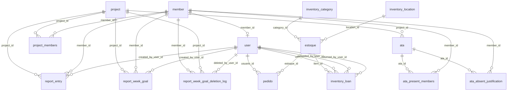

# Modelagem do Banco de Dados

Fonte de verdade: `src/database.js` (função `ensureSchema()`).

## Visão Geral
O sistema está organizado em 4 domínios principais:
- Pessoas e acesso (`member`, `user`)
- Projetos, atas e presença (`project`, `project_members`, `ata`, `ata_present_members`, `ata_absent_justification`)
- Relatórios semanais (`report_entry`, `report_week_goal`, `report_week_goal_deletion_log`)
- Almoxarifado (`estoque`, `pedido`, `inventory_category`, `inventory_location`, `inventory_loan`)

## Diagrama (ER)

## Tabelas

### `member`
- `id` PK
- `name` `UNIQUE NOT NULL`
- `photo` (URL/caminho da foto)
- `is_active` (`0/1`)

### `user`
- `id` PK
- `username` `UNIQUE NOT NULL`
- `password_hash` `NOT NULL`
- `name`
- `role` (`admin` ou `common`)
- `member_id` FK -> `member.id` (opcional)

### `project`
- `id` PK
- `name` `UNIQUE NOT NULL`
- `logo`
- `primary_color` (hex)

### `project_members` (N:N projeto x membro)
- `project_id` FK -> `project.id`
- `member_id` FK -> `member.id`
- `is_coordinator` (`0/1`)
- PK composta: (`project_id`, `member_id`)

### `ata`
- `id` PK
- `meeting_datetime`
- `location_type`
- `location_details`
- `notes`
- `created_at`
- `project_id` FK -> `project.id`

### `ata_present_members` (N:N ata x membro)
- `ata_id` FK -> `ata.id`
- `member_id` FK -> `member.id`
- PK composta: (`ata_id`, `member_id`)

### `ata_absent_justification`
- `ata_id` FK -> `ata.id`
- `member_id` FK -> `member.id`
- `justification`
- PK composta: (`ata_id`, `member_id`)

### `report_entry` (legado de texto semanal)
- `id` PK
- `project_id` FK -> `project.id`
- `member_id` FK -> `member.id`
- `created_by_user_id` FK -> `user.id`
- `week_start`
- `status`
- `content`
- `created_at`, `updated_at`

### `report_week_goal` (metas semanais)
- `id` PK
- `member_id` FK -> `member.id`
- `project_id` FK -> `project.id`
- `created_by_user_id` FK -> `user.id`
- `week_start`
- `activity`
- `description`
- `is_completed` (`0/1`)
- `completed_at`
- `created_at`, `updated_at`

### `report_week_goal_deletion_log` (auditoria de exclusão)
- `id` PK
- `goal_id` (id da meta original apagada)
- `member_id` FK -> `member.id`
- `project_id` FK -> `project.id`
- `deleted_by_user_id` FK -> `user.id`
- `week_start`
- `activity`
- `description`
- `completed_at`
- `deleted_at`

### `inventory_category`
- `id` PK
- `name` `UNIQUE NOT NULL`

### `inventory_location`
- `id` PK
- `name` `UNIQUE NOT NULL`

### `estoque`
- `id` PK
- `name`
- `item_type` (`stock` ou `patrimony`)
- `category` (texto legado)
- `category_id` FK lógica para `inventory_category.id`
- `location` (texto legado)
- `location_id` FK lógica para `inventory_location.id`
- `amount`
- `description`

### `pedido`
- `id` PK
- `qtd_retirada`
- `usuario_id` FK -> `user.id`
- `estoque_id` FK -> `estoque.id`
- `data_pedido`

### `inventory_loan`
- `id` PK
- `item_id` FK -> `estoque.id`
- `user_id` FK -> `user.id`
- `quantity`
- `borrowed_at`
- `original_due_at`
- `due_at`
- `returned_at`
- `extended_at`
- `extended_by_user_id` FK -> `user.id`
- `returned_by_user_id` FK -> `user.id`

## Índices relevantes
- Relatórios: membro/projeto/semana/conclusão (`report_week_goal`) e logs de exclusão.
- Atas: data da reunião (`ata.meeting_datetime`).
- Almoxarifado: nome/tipo/categoria/local em `estoque`, além de índices de empréstimos e pedidos.
- Associação de coordenadores: `ix_project_members_project_coordinator` em (`project_id`, `is_coordinator`).

## Regras de negócio refletidas no esquema
- Um `user` pode ou não estar vinculado a um `member`.
- Coordenação de projeto é por vínculo em `project_members.is_coordinator`.
- Metas semanais são registradas por membro + projeto + semana.
- Exclusão de metas concluídas é auditada em `report_week_goal_deletion_log`.
- Almoxarifado já migrou para categorias/locais normalizados, mantendo colunas legadas em `estoque` por compatibilidade.
